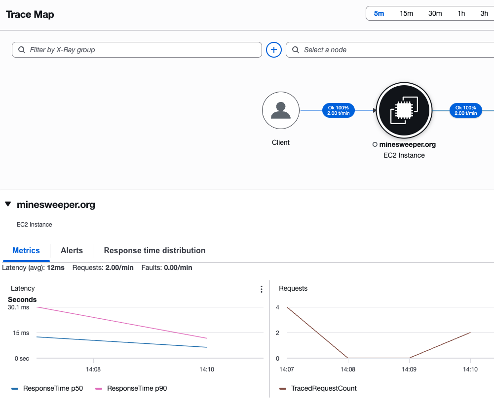
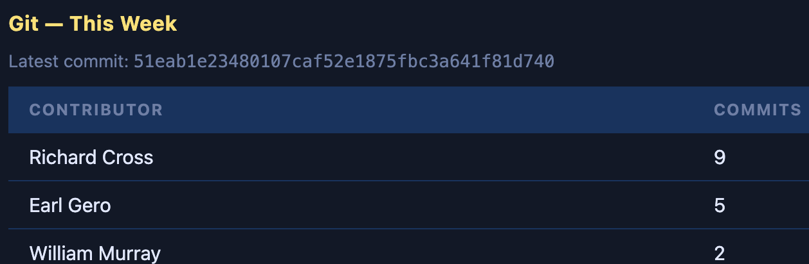

# minesweeper.org

Free online Minesweeper — classic, no-guess, real-time PvP duel, Rush, Tentaizu, Mosaic, and more.

**Live site:** https://minesweeper.org
**GitHub:** https://github.com/ajaxchess/minesweeper.org
**Author:** Richard Cross

---

## About

Minesweeper.org was originally launched in 2001 and dedicated to Diana, Princess of Wales, and the charity she supported — [The HALO Trust](https://www.halousa.org/).

The original site can be seen at the [Wayback Machine](https://web.archive.org/web/20040325004955/http://www.minesweeper.org/). One goal of this project is to bring back the original look, feel, and mission.

---

## Stack

- **Python 3** / **FastAPI** / **Uvicorn**
- **Jinja2** templates
- **MySQL** (via SQLAlchemy + PyMySQL)
- **Apache2** reverse proxy with WebSocket support (`mod_proxy_wstunnel`)
- Google OAuth 2.0 (sign-in), Google Analytics, Google AdSense

---

## Installation (Ubuntu 22.04+)

### 1. Clone the repository

```bash
git clone https://github.com/ajaxchess/minesweeper.org /home/ubuntu/minesweeper
cd /home/ubuntu/minesweeper
```

### 2. Configure environment variables

```bash
cp .env_example .env
nano .env   # fill in all required values (see .env_example for descriptions)
```

**Required values in `.env`:**

| Variable | Description |
|---|---|
| `DB_USER` | MySQL username |
| `DB_PASS` | MySQL password |
| `GOOGLE_CLIENT_ID` | From [Google Cloud Console](https://console.cloud.google.com/apis/credentials) |
| `GOOGLE_CLIENT_SECRET` | From Google Cloud Console |
| `SECRET_KEY` | Random string — generate with `python3 -c "import secrets; print(secrets.token_hex(32))"` |
| `GA_TAG` | Google Analytics tag (optional, e.g. `G-XXXXXXXXXX`) |
| `ADMIN_EMAILS` | Comma-separated list of admin Google account emails |

### 3. Run the automated install script

```bash
sudo bash scripts/install_ubuntu.sh
```

This script:
- Installs system packages (Python 3, Node.js, MySQL, Apache2, Certbot)
- Creates the MySQL database and user
- Sets up the Python virtual environment and installs all dependencies
- Installs `terser` and `csso-cli` globally for JS/CSS minification
- Generates `database.py` from `database_template.py`
- Builds minified static assets
- Installs and starts the `minesweeper` systemd service
- Configures Apache2 as a reverse proxy with WebSocket support
- Installs the cron-based auto-deploy (every 5 minutes via `git pull`)

### 4. Get an SSL certificate

```bash
sudo certbot --apache -d minesweeper.org -d www.minesweeper.org
```

### 5. Verify

```bash
sudo systemctl status minesweeper
sudo journalctl -u minesweeper -f
```

---

## Files synced manually to the server

These are **gitignored** — manage and sync them independently:

| Path | Purpose |
|---|---|
| `.env` | Credentials and configuration |
| `database.py` | Generated from `database_template.py` with real credentials |
| `analysis/` | Markdown files displayed at `/admin/analysis` |
| `bots/` | PvP bot AI code (`minesweeper_bot.py`) |
| `screenshots/` | Local screenshots for development |

---

## Database

```sql
CREATE DATABASE minesweeper CHARACTER SET utf8mb4 COLLATE utf8mb4_unicode_ci;
CREATE USER 'minesweeper_user'@'localhost' IDENTIFIED BY 'your_password';
GRANT ALL PRIVILEGES ON minesweeper.* TO 'minesweeper_user'@'localhost';
FLUSH PRIVILEGES;
```

The `database_template.py` file contains placeholder credentials. The deploy script copies it to `database.py` and substitutes real credentials from `.env` whenever the template changes.

---

## Development

```bash
python3 -m venv venv
source venv/bin/activate
pip install -r requirements.txt
uvicorn main:app --reload --host 127.0.0.1 --port 8000
```

---

## Deployment

Auto-deploy runs via cron every 5 minutes:

```bash
tail -f /var/log/minesweeper-deploy.log   # deploy logs
sudo systemctl restart minesweeper        # manual restart
sudo journalctl -u minesweeper -f         # app logs
```

The deploy script (`scripts/minesweeper_service_update_and_restart.sh`):
1. Pulls latest changes from `main`
2. Runs `scripts/build_assets.sh` to minify JS/CSS
3. Runs `pip install -r requirements.txt` if needed
4. Regenerates `database.py` if `database_template.py` changed
5. Restarts the systemd service

---

## Observability

Minesweeper.org leverages **AWS Bedrock** to monitor the health of the infrastructure. Bedrock provides AI-powered analysis of application metrics, logs, and deployment events, enabling proactive detection of anomalies and degraded service conditions.

Key observability touchpoints:

| Signal | Source |
|---|---|
| Application health | `GET /health` — returns status, git commit, and environment |
| Uptime probe | `GET /iamatestfile.txt` — lightweight endpoint for load balancer and external monitors |
| Server metrics | CPU, memory, disk, and network stats recorded hourly to the `server_stats` table |
| Deploy gate | Staging smoke tests run after every deploy; failed commits are blocked from reaching production |
| App logs | `sudo journalctl -u minesweeper -f` |
| Deploy logs | `tail -f /var/log/minesweeper-deploy.log` |

### Operations — AWS X-Ray Performance Monitoring

The application is instrumented with **OpenTelemetry** (via `telemetry.py`). Traces are exported over OTLP HTTP to the **AWS Distro for OpenTelemetry (ADOT) Collector**, which forwards them to **AWS X-Ray** for performance analysis.

X-Ray provides a live trace map showing request flow from client to EC2 instance, latency distributions (p50/p99 response times), and per-route request counts — giving the team visibility into production performance without manual log analysis.



**What is instrumented:**

| Instrumentation | What it captures |
|---|---|
| FastAPI routes | Every HTTP request as a trace span |
| SQLAlchemy | Every database query as a child span |
| Outbound HTTP | External API calls (httpx / requests) as child spans |
| Logging | `trace_id` and `span_id` injected into every log record |
| Score submissions | Custom metric — completions by game type and mode |
| Game duration | Custom histogram — time-to-complete in milliseconds |
| Scheduler jobs | Success/failure counter for `reset_scores`, `collect_server_stats`, `archive_guest_scores` |
| DB errors | Error counter tagged by operation |

**Configuration** (in `.env`):

```
OTEL_EXPORTER_OTLP_ENDPOINT=http://localhost:4318
OTEL_SERVICE_NAME=minesweeper.org
OTEL_SERVICE_VERSION=1.0.0
```

Leave `OTEL_EXPORTER_OTLP_ENDPOINT` blank to disable tracing entirely (default in development).

---

## Software Development Gamification

Minesweeper.org uses gamification to keep the development team engaged and productive. The admin dashboard (accessible to team members at `/admin`) includes a **Git commit leaderboard** that tracks each contributor's weekly commit count — turning day-to-day development work into a friendly competition.



The leaderboard refreshes on every admin page load and shows:

- **Contributor** — git author name
- **Commits this week** — count of commits since Monday (UTC)
- **Latest commit SHA** — the current HEAD on the running server, compared against staging to confirm deployments are in sync

This lightweight approach to gamification encourages consistent contribution, surfaces who is actively shipping, and makes the weekly cadence of the team visible at a glance — without requiring any external tooling.

---

## Blog

To add a post: drop a `.md` file in `blog/` and add one dict to `BLOG_POSTS` in `main.py`. No other changes needed.

---

## systemd service

```ini
[Unit]
Description=Minesweeper FastAPI App
After=network.target mysql.service

[Service]
User=ubuntu
WorkingDirectory=/home/ubuntu/minesweeper
ExecStart=/home/ubuntu/minesweeper/venv/bin/uvicorn main:app --host 127.0.0.1 --port 8000 --workers 2
Restart=always

[Install]
WantedBy=multi-user.target
```
